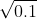
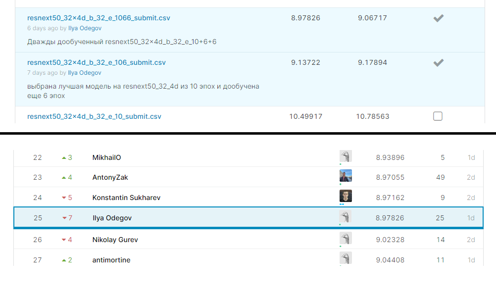

# MADE CV CONTEST 1
# Описание решения, которое получило лучший *score* на *kaggle*.

 Обучение проводилось локально. В качестве рабочей машины использовался:
  * *Acer Nitro 5 Intel i5-9300H 2.40GHz 8GB Ram NVIDIA GeForce GTX 1650 4GB*.

 Во время проведения контеста проведен поиск подходящей архитектуры. Проверены основные модели, которые были взяты из torchvision. Использовал:
  1. *alexnet* (score: 21);
  2. *resnet18/34/50* (получены результаты: score 13-17);
  3. *dencenet121/161* (score: 11-12);
  4. *resnext50_32_4d* (получен лучший score).

 После выбора лучшей архитектуры перешел к поиску оптимальных параметров рутины обучения (выбор оптимизатора, *lr_scheduler*, параметров "головы", предсказывающей расположение точек). В качестве оптимизатора были проверены:

 1. *Adam()*;
 2. *AdamW()*.

 В качестве основного оптимизатора был выбран *AdamW()*, с параметром *weight_declay*=0.05.

Для изменения *lr* были проверены 2 *lr_scheduler*:
 1. *ReduceLROnPlateau*;
 2. *StepLR*.
 
 Лучше всего себя показал, *ReduceLROnPlateau*, в дальнейшем для улучшения качества обучения, был проведен подбор параметров. В качестве конечных значений, для параметров *lr_scheduler* были выбраны *patience=1, factor=
 
 В качестве "голов" использовались 1-но слойные, 2-ух слойные, 3-ёх слойные полносвязные нейронные сети с различными конфигурациями слоев (количество нейронов в слое). Так же были использованы Dropout, BatchNorm слои, в различных вариациях. В качестве функций активации между слоями использовалась *ReLU*.
 
 Лучший результат показала сеть *resnext50_32_4d* c однослойной FC "головой", дообученная 2 раза, без дополнительных манипуляций с данными на входе в "голову".
 
 После выбора параметров головы, было проведено более тонкое обучение полученной сети. Обучение сети проходило в 3 этапа. Первый этап включал в себя 10 эпох обучения, второй и третий по 6 эпох. Каждое дообучение проводилось на лучшей модели предыдущего этапа, для этого в *argparser* была добавлена новая переменная (*-pm/--pretrained-model*). Так же на каждом новом этапе, уменьшался на порядок стартовое значение learning_rate. В качестве начального *lr* была выбрана так называемая *karpathy constant* равная 3*e*-4. Так как количество оперативной памяти видеоадаптера относительно небольшое, размер батча был подобран, исходя из этого *batch_size=32*.
 
 Список команд для обучения с нуля:
 1. *cmd: python hack_train.py -b 32 -e 10 -lr 3e-4 -d "" -n "resnext50_32x4d_b_32_e_10" --gpu*
 2. *cmd* для первого дообучения:
 *python hack_train.py -b 32 -e 6 -lr 3e-5 -d "" -n "resnext50_32x4d_b_32_e_10+6" --gpu -pm "resnext50_32x4d_b_32_e_10_best.pth"*
 3. *cmd* для второго дообучения:
 *python hack_train.py -b 32 -e 6 -lr 3e-6 -d "" -n "resnext50_32x4d_b_32_e_10+6+6" --gpu -pm "resnext50_32x4d_b_32_e_10+6_best.pth"*
 
 После получения результат, который в итоге стал лучшим, мной был проведен еще один круг экспериментов. Сверточные слой данной сети был заморожен и через него не шли градиенты, зато в качестве слоев прогнозирования были рассмотрены 2-ух, 3-ёх слойные FC сети, c различными конфигурациями (количество количество нейронов в слое, наличие слоя Dropout и BatchNorm). К сожалению, данные эксперименты дали результат чуть хуже (финальный score на 0.2-0.3 больше лучшего).

Ниже прикреплен скриншот лучшего *score* и моей позиции на *leaderboad*:

А так же словари с параметрами каждой модели, полученные в результате цикла из 3 обучений, расположены по ссылке: [словарь 1-го этапа обучения](https://yadi.sk/d/WTbtJmVoyKMIWA), [словарь 2-го этапа обучения](https://yadi.sk/d/Hh2U_zUFxGmPpA), [словарь 3-го этапа обучения](https://yadi.sk/d/xuB7PB9H79RS1A)
 ИД должны лежать в папке с файлами python и быть разархивированными.

